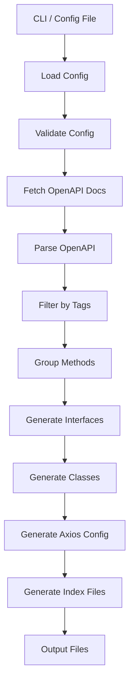

# План рефакторинга API Docs Axios TS Generator

## Обзор

Приложение генерирует TypeScript интерфейсы и классы с методами axios из OpenAPI спецификаций. Цель рефакторинга - подготовить приложение к публикации на npm с поддержкой конфигурационного файла.

## Текущая архитектура

```
src/
├── index.js                                    # Точка входа с CLI
├── parse-and-generate/
│   └── parseAndGenerate.js                     # Парсинг OpenAPI и генерация
├── generate-class/
│   └── generateClass.js                        # Генерация классов
├── generate-method/
│   └── generateMethod.js                       # Генерация методов
├── generate-interface/
│   └── generateInterface.js                    # Генерация интерфейсов
├── resolve-type/
│   └── resolveType.js                          # Разрешение типов
├── map-type/
│   └── mapType.js                              # Маппинг типов
├── generate-js-doc/
│   └── generateJSDoc.js                        # Генерация JSDoc
├── clean-generated-folder/
│   └── cleanGeneratedFolder.js                 # Очистка папки
├── update-api-docs-json/
│   └── updateApiDocsJson.js                    # Загрузка OpenAPI
├── generate-index-file-with-public-api/
│   └── generateIndexFileWithPublicApi.js      # Генерация index.ts
└── generate-main-index-file/
    └── generateMainIndexFile.js               # Главный index.ts
```

## Новая архитектура после рефакторинга

```
.
├── src/
│   ├── index.js                                # Точка входа CLI
│   ├── types/
│   │   └── config.types.ts                     # Типы конфигурации
│   ├── config/
│   │   ├── loadConfig.ts                       # Загрузка конфигурации
│   │   ├── defaultConfig.ts                    # Конфигурация по умолчанию
│   │   └── validateConfig.ts                   # Валидация конфигурации
│   ├── generators/
│   │   ├── classGenerator.js                   # Генератор классов
│   │   ├── methodGenerator.js                  # Генератор методов
│   │   ├── interfaceGenerator.js               # Генератор интерфейсов
│   │   ├── indexGenerator.js                   # Генератор index файлов
│   │   └── axiosConfigGenerator.js             # Генератор конфигурации axios
│   ├── parsers/
│   │   ├── openApiParser.js                    # Парсер OpenAPI
│   │   └── tagFilter.js                        # Фильтрация по тегам
│   ├── utils/
│   │   ├── typeResolver.js                     # Разрешение типов
│   │   ├── typeMapper.js                       # Маппинг типов
│   │   └── jsDocGenerator.js                   # Генератор JSDoc
│   └── core/
│       ├── cleanFolder.js                      # Очистка папки
│       └── fetchApiDocs.js                     # Загрузка OpenAPI
├── api-docs-generator.config.ts               # Пример конфигурации
├── package.json                                # Пакет для npm
├── README.md                                   # Документация
├── .npmignore                                  # Исключения для npm
├── examples/
│   └── basic-usage/
│       ├── config.ts                           # Пример конфигурации
│       └── README.md                           # Описание примера
└── CHANGELOG.md                                # История изменений
```

## Структура конфигурационного файла

```typescript
interface GeneratorConfig {
  // Источник OpenAPI спецификации
  apiDocsUrl?: string;
  apiDocsPath?: string;

  // Параметры вывода
  outputDir: string;
  interfacesDir?: string;
  classesDir?: string;

  // Фильтрация по тегам
  tags?: {
    include?: string[];      // Теги для включения
    exclude?: string[];      // Теги для исключения
    prefix?: string;         // Префикс тегов (например, "api_tag_")
  };

  // Группировка классов
  groupBy: 'tag' | 'all' | 'path';

  // Режим генерации классов
  classMode: 'single' | 'multiple';

  // Настройки именования
  naming?: {
    className?: (tag: string) => string;
    interfaceName?: (name: string) => string;
    methodName?: (operationId: string) => string;
  };

  // Настройки импортов
  imports?: {
    axiosPath?: string;
    baseUrlPath?: string;
  };

  // Дополнительные опции
  options?: {
    generateJSDoc?: boolean;
    generateIndexFiles?: boolean;
    cleanOutputDir?: boolean;
    generateAxiosConfig?: boolean;  // Генерация конфигурации axios
    allowAxiosConfigSpread?: boolean;  // Разрешить распыление пользовательских конфигураций
  };

  // Настройки axios
  axios?: {
    baseURL?: string;
    timeout?: number;
    headers?: Record<string, string>;
    withCredentials?: boolean;
  };
}
```

## Детальный план реализации

### 1. Создание типов конфигурации

**Файл:** `src/types/config.types.ts`

```typescript
export interface GeneratorConfig {
  apiDocsUrl?: string;
  apiDocsPath?: string;
  outputDir: string;
  interfacesDir?: string;
  classesDir?: string;
  tags?: TagFilter;
  groupBy: 'tag' | 'all' | 'path';
  classMode: 'single' | 'multiple';
  naming?: NamingOptions;
  imports?: ImportOptions;
  options?: GeneratorOptions;
}

export interface TagFilter {
  include?: string[];
  exclude?: string[];
  prefix?: string;
}

export interface NamingOptions {
  className?: (tag: string) => string;
  interfaceName?: (name: string) => string;
  methodName?: (operationId: string) => string;
}

export interface ImportOptions {
  axiosPath?: string;
  baseUrlPath?: string;
}

export interface GeneratorOptions {
  generateJSDoc?: boolean;
  generateIndexFiles?: boolean;
  cleanOutputDir?: boolean;
  generateAxiosConfig?: boolean;
  allowAxiosConfigSpread?: boolean;
}

export interface AxiosConfig {
  baseURL?: string;
  timeout?: number;
  headers?: Record<string, string>;
  withCredentials?: boolean;
}
```

### 2. Создание конфигурации по умолчанию

**Файл:** `src/config/defaultConfig.ts`

```typescript
import { GeneratorConfig } from '../types/config.types';

export const defaultConfig: Partial<GeneratorConfig> = {
  outputDir: './generated',
  interfacesDir: './generated/interfaces',
  classesDir: './generated/classes',
  groupBy: 'tag',
  classMode: 'multiple',
  tags: {
    prefix: 'api_tag_',
  },
  imports: {
    axiosPath: 'axios',
    baseUrlPath: './config/axios/axios',
  },
  options: {
    generateJSDoc: true,
    generateIndexFiles: true,
    cleanOutputDir: true,
  },
};
```

### 3. Создание модуля загрузки конфигурации

**Файл:** `src/config/loadConfig.ts`

```typescript
import { GeneratorConfig } from '../types/config.types';
import { defaultConfig } from './defaultConfig';
import { validateConfig } from './validateConfig';

export async function loadConfig(configPath?: string): Promise<GeneratorConfig> {
  // 1. Загрузка конфигурации из файла
  // 2. Слияние с конфигурацией по умолчанию
  // 3. Валидация
  // 4. Возврат полной конфигурации
}
```

### 4. Создание модуля валидации

**Файл:** `src/config/validateConfig.ts`

```typescript
import { GeneratorConfig } from '../types/config.types';

export function validateConfig(config: GeneratorConfig): void {
  // Валидация обязательных полей
  // Проверка путей
  // Проверка параметров фильтрации
  // Проверка режимов генерации
}
```

### 5. Рефакторинг точки входа

**Изменения в `src/index.js`:**

- Замена жестко заданных параметров на загрузку из конфигурации
- Поддержка CLI аргументов для переопределения конфигурации
- Добавление опции `--config` для указания пути к конфигурационному файлу

### 6. Рефакторинг парсера OpenAPI

**Новый файл:** `src/parsers/openApiParser.js`

```javascript
class OpenApiParser {
  constructor(config) {
    this.config = config;
  }

  parse(apiDocs) {
    // Парсинг с учетом конфигурации
    // Фильтрация по тегам
    // Группировка методов
  }

  filterByTags(tags, methods) {
    // Фильтрация методов по тегам
  }

  groupMethods(methods, groupBy) {
    // Группировка методов (по тегам, все вместе, по путям)
  }
}
```

### 7. Создание генератора конфигурации axios

**Файл:** `src/generators/axiosConfigGenerator.js`

```javascript
const fs = require('fs');
const path = require('path');

/**
 * Генерирует конфигурацию axios для сгенерированного API клиента
 * @param {Object} config - Конфигурация генератора
 * @param {string} outputDir - Директория вывода
 */
function generateAxiosConfig(config, outputDir) {
  const axiosDir = path.join(outputDir, 'config', 'axios');
  fs.mkdirSync(axiosDir, { recursive: true });

  const axiosConfig = config.axios || {};
  const baseURL = axiosConfig.baseURL || '';
  const timeout = axiosConfig.timeout || 30000;
  const headers = axiosConfig.headers || { 'Content-Type': 'application/json' };
  const withCredentials = axiosConfig.withCredentials || false;

  // Генерация файла axios.ts
  const axiosTsContent = `import axios, { AxiosInstance, AxiosRequestConfig } from 'axios';

export const BASE_URL = '${baseURL}';

const axiosConfig: AxiosRequestConfig = {
  baseURL: BASE_URL,
  timeout: ${timeout},
  headers: ${JSON.stringify(headers, null, 2)},
  withCredentials: ${withCredentials},
};

const axiosInstance: AxiosInstance = axios.create(axiosConfig);

// Перехватчик запросов
axiosInstance.interceptors.request.use(
  (config) => {
    // Можно добавить токен авторизации
    // const token = localStorage.getItem('token');
    // if (token) {
    //   config.headers.Authorization = \`Bearer \${token}\`;
    // }
    return config;
  },
  (error) => {
    return Promise.reject(error);
  }
);

// Перехватчик ответов
axiosInstance.interceptors.response.use(
  (response) => {
    return response;
  },
  (error) => {
    // Обработка ошибок
    if (error.response) {
      // Сервер ответил со статусом, отличным от 2xx
      console.error('Response error:', error.response.status, error.response.data);
    } else if (error.request) {
      // Запрос был сделан, но ответ не получен
      console.error('Request error:', error.request);
    } else {
      // Произошла ошибка при настройке запроса
      console.error('Error:', error.message);
    }
    return Promise.reject(error);
  }
);

export default axiosInstance;
`;

  fs.writeFileSync(path.join(axiosDir, 'axios.ts'), axiosTsContent, { encoding: 'utf-8' });
  console.log(`Generated axios config at: ${axiosDir}/axios.ts`);
}

module.exports = { generateAxiosConfig };
```

### 8. Рефакторинг генератора классов

**Новый файл:** `src/generators/classGenerator.js`

```javascript
class ClassGenerator {
  constructor(config) {
    this.config = config;
  }

  generate(className, methods, usedInterfaces) {
    // Генерация класса с учетом конфигурации
    // Поддержка режима single/multiple
    // Кастомные импорты
  }

  generateSingleClass(allMethods, allInterfaces) {
    // Генерация одного класса для всех методов
  }
}
```

### 9. Создание package.json

**Основные поля:**

```json
{
  "name": "api-docs-axios-ts-generator",
  "version": "1.0.0",
  "description": "Generate TypeScript interfaces and axios classes from OpenAPI documentation",
  "main": "src/index.js",
  "bin": {
    "api-docs-generator": "./bin/cli.js"
  },
  "types": "dist/types/index.d.ts",
  "scripts": {
    "build": "tsc",
    "prepare": "npm run build"
  },
  "keywords": [
    "openapi",
    "swagger",
    "typescript",
    "axios",
    "generator",
    "api-client"
  ],
  "dependencies": {
    "commander": "^11.0.0",
    "node-fetch": "^2.7.0",
    "axios": "^1.6.0"
  },
  "devDependencies": {
    "@types/node": "^20.0.0",
    "typescript": "^5.0.0"
  },
  "files": [
    "src",
    "dist",
    "bin",
    "README.md",
    "LICENSE"
  ]
}
```

### 9. Создание примера конфигурации

**Файл:** `api-docs-generator.config.ts`

```typescript
import { GeneratorConfig } from './src/types/config.types';

const config: GeneratorConfig = {
  apiDocsUrl: 'https://api.example.com/v3/api-docs.json',
  outputDir: './generated',
  
  tags: {
    include: ['api_tag_users', 'api_tag_products'],
    exclude: ['api_tag_internal'],
    prefix: 'api_tag_',
  },
  
  groupBy: 'tag',
  classMode: 'multiple',
  
  naming: {
    className: (tag) => tag.replace('api_tag_', '') + 'Api',
    interfaceName: (name) => name,
    methodName: (operationId) => operationId,
  },
  
  imports: {
    axiosPath: 'axios',
    baseUrlPath: './config/axios/axios',
  },

  options: {
    generateJSDoc: true,
    generateIndexFiles: true,
    cleanOutputDir: true,
    generateAxiosConfig: true,
  },

  axios: {
    baseURL: 'https://api.example.com',
    timeout: 30000,
    headers: {
      'Content-Type': 'application/json',
    },
  },
};

export default config;
```

## Диаграмма потока данных



## Примеры использования

### Генерация по тегам (несколько классов)

```typescript
{
  tags: {
    include: ['api_tag_users', 'api_tag_products'],
  },
  groupBy: 'tag',
  classMode: 'multiple',
}
```

Результат:
```
generated/
├── classes/
│   ├── users/
│   │   └── UsersApi.ts
│   └── products/
│       └── ProductsApi.ts
```

### Генерация одного класса

```typescript
{
  groupBy: 'all',
  classMode: 'single',
}
```

Результат:
```
generated/
└── classes/
    └── ApiClient.ts
```

### Исключение тегов

```typescript
{
  tags: {
    exclude: ['api_tag_internal', 'api_tag_admin'],
  },
}
```

### Генерация с конфигурацией axios

```typescript
{
  apiDocsUrl: 'https://api.example.com/v3/api-docs.json',
  outputDir: './src/api',

  options: {
    generateAxiosConfig: true,
  },

  axios: {
    baseURL: 'https://api.example.com',
    timeout: 30000,
    headers: {
      'Content-Type': 'application/json',
      'X-API-Key': 'your-api-key',
    },
    withCredentials: true,
  },
}
```

Результат:
```
src/api/
├── config/
│   └── axios/
│       └── axios.ts          # Конфигурация axios с перехватчиками
├── interfaces/
│   ├── User.ts
│   └── index.ts
├── classes/
│   ├── users/
│   │   └── UsersApi.ts       # Импортирует axios из config/axios/axios
│   └── index.ts
└── index.ts
```

## Распыление пользовательских конфигураций axios

При включённой опции `allowAxiosConfigSpread: true`, методы API будут поддерживать распыление пользовательских конфигураций axios через параметр `config`:

### Пример использования:

```typescript
// Сгенерированный метод
async getUserById(id: number, config?: AxiosRequestConfig): Promise<AxiosResponse<User>> {
  const fullURL = `${BASE_URL}/users/${id}`;
  return axios.get(fullURL, config);
}

// Использование с пользовательской конфигурацией
const response = await usersApi.getUserById(123, {
  headers: {
    'X-Custom-Header': 'value',
  },
  timeout: 5000,
});

// Распыление дополнительных параметров запроса
const response = await usersApi.getUsers({
  page: 1,
  limit: 10,
}, {
  params: {
    sort: 'name',
  },
});
```

### Конфигурация для включения этой функции:

```typescript
{
  options: {
    allowAxiosConfigSpread: true,
  },
}
```

Эта опция позволяет пользователям передавать любые конфигурации axios при вызове методов, включая:
- Кастомные заголовки
- Таймауты для конкретных запросов
- Дополнительные параметры запроса
- Конфигурацию перехватчиков
- И любые другие опции AxiosRequestConfig
```

## Обратная совместимость

Для сохранения обратной совместимости с существующим CLI:

```bash
# Старый способ (все еще работает)
node src/index.js --api-docs-url https://api.example.com/docs.json

# Новый способ с конфигурацией
node src/index.js --config api-docs-generator.config.ts

# Переопределение параметров через CLI
node src/index.js --config api-docs-generator.config.ts --output-dir ./custom-output
```

## Следующие шаги

1. Создать структуру типов конфигурации
2. Реализовать загрузку и валидацию конфигурации
3. Рефакторинг существующих модулей для поддержки конфигурации
4. Создать package.json и подготовить к публикации
5. Написать документацию и примеры
6. Создать TypeScript declaration файлы
7. Тестирование различных сценариев использования
